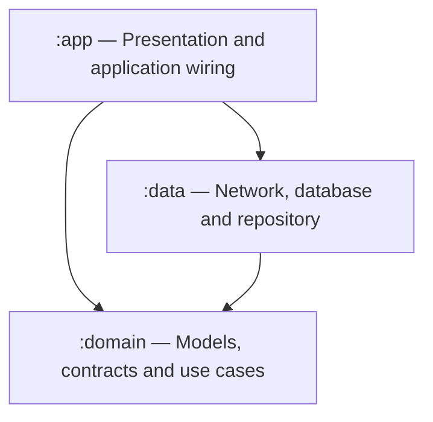

# Architecture & Engineering Summary

## Leboncoin Android Technical Assessment

**Repository:
** [ycharbel88/leboncoin-android-test](https://github.com/ycharbel88/leboncoin-android-test)  
**Reviewed revision:** [
`7020a07e213fe4d373c71e9de2c9b90e84553c2d`](https://github.com/ycharbel88/leboncoin-android-test/tree/7020a07e213fe4d373c71e9de2c9b90e84553c2d)  
**Document date:** 2 October 2026

This document describes the implementation at the reviewed revision, explains its engineering
choices, and identifies proposed improvements. Recommendations are not presented as completed work.
Build and test outcomes require execution against the final submission revision.

## 1. Purpose and scope

The application displays the items supplied by the Leboncoin technical-test endpoint, supports item
details and persistent favorites, and makes previously downloaded data available offline. The
implementation uses three Gradle modules, Kotlin, Compose, Hilt, Retrofit, Room, and Paging.

The architecture is intentionally small enough for an assessment while separating presentation,
application contracts, and infrastructure. Further modules or generic frameworks should be
introduced only when a concrete requirement justifies them.

## 2. Implemented features

| Feature                          | Current implementation and scope                                                                                                   |
|----------------------------------|------------------------------------------------------------------------------------------------------------------------------------|
| Catalog browsing                 | Room-backed Paging displayed through a Compose `LazyColumn`, with stable item IDs                                                  |
| Initial synchronization          | `AlbumsViewModel` starts a network refresh on creation                                                                             |
| Manual refresh                   | Pull-to-refresh downloads the catalog and updates Room                                                                             |
| Loading, empty, and error states | Catalog UI combines Paging load states with network refresh state                                                                  |
| Cached-content error handling    | A refresh error can appear alongside existing catalog content; retry and dismissal are supported                                   |
| Local favorites                  | A database flag is toggled with one SQL update and remains available after restarting the app                                      |
| Favorites screen                 | Observes the Room favorites query and displays empty or populated state                                                            |
| Item details                     | Observes an item by its unique `id`; displays artwork, title, identifiers, and favorite action                                     |
| Cross-screen consistency         | Catalog, favorites, and details read the same Room database; writes update active observers and invalidate relevant paging sources |
| Offline catalog access           | Previously persisted catalog content remains available when a subsequent network request fails                                     |
| Image caching                    | Shared Coil 3 loader with memory and disk caches; cached images can be reused                                                      |
| Image fallback                   | Detail artwork has placeholder, error, and null-data fallback imagery                                                              |
| Adaptive layout                  | A list-detail scaffold adapts pane presentation to the available window configuration                                              |
| Tab navigation                   | Albums and Favorites tabs, with a bottom bar on compact list screens and navigation inside the list pane on wider layouts          |
| Back handling                    | System Back delegates to pane navigation when possible, otherwise returns from Favorites to Albums                                 |
| UI state saving                  | Selected tab and per-tab saveable Compose state use `rememberSaveable` and `SaveableStateHolder`                                   |
| Diagnostics                      | Debug-only HTTP body logging, debug LeakCanary dependency, and a lightweight analytics helper                                      |
| Automated test sources           | ViewModel, composable, repository, DAO, mapper, and use-case tests are present                                                     |

Offline availability requires a previous successful download. Image caching is best effort: uncached
images require network access, and cached files can be evicted. The application does not guarantee
that every catalog image is downloaded for offline use.

## 3. Module structure and dependency direction



| Module              | Responsibilities                                                                                            | Main dependencies                                                                             |
|---------------------|:------------------------------------------------------------------------------------------------------------|-----------------------------------------------------------------------------------------------|
| `:app`              | Application and Activity entry points, Compose UI, ViewModels, adaptive navigation, use-case DI wiring      | Compose, Spark, Lifecycle, Hilt, Paging Compose, Coil, Material adaptive components           |
| `:domain`           | `Album`, `AlbumRepository`, and use cases                                                                   | Kotlin/JVM, Coroutines, Paging Common                                                         |
| `:data`             | API service, DTOs, Room entities/DAO/database, mappers, repository implementation, infrastructure providers | Retrofit, Kotlin Serialization, OkHttp, Room, Paging, Hilt; currently also Coil configuration |

The dependency from `:app` to `:data` supports application assembly. UI behavior accesses
persistence and networking through domain contracts rather than directly using DAOs or Retrofit
services.

The domain module is a Kotlin/JVM module without Android framework, Compose, Room, Retrofit, or Hilt
dependencies. It does expose `PagingData` and depends on `androidx.paging:paging-common`. This is an
explicit library coupling, accepted here to avoid building a custom paging abstraction.

### Domain model and contracts

`Album` contains `id`, `albumId`, `title`, `url`, `thumbnailUrl`, and `isFavorite`.

- `id` identifies the individual item and is used for database lookup, list identity, detail
  selection, and favorite updates.
- `albumId` is a grouping identifier. It must not be substituted for the unique item ID.
- List position is never an item identity.

`AlbumRepository` exposes:

- `getAlbumsStream(): Flow<List<Album>>`
- `getFavoriteAlbumsStream(): Flow<List<Album>>`
- `getAlbumByIdStream(id): Flow<Album?>`
- `getAlbumsPaged(): Flow<PagingData<Album>>`
- `toggleFavorite(albumId)`
- `refreshAlbums()`

The `albumId` parameter of `toggleFavorite` currently means the unique item `id`. Renaming this
parameter to `itemId` or `id` would remove ambiguity without changing behavior.

Use cases mirror these operations: `GetAlbumsStreamUseCase`, `GetAlbumsPagingUseCase`,
`GetFavoriteAlbumsUseCase`, `GetAlbumByIdUseCase`, `ToggleFavoriteUseCase`, and
`RefreshAlbumsUseCase`. They provide a consistent presentation-facing API. Additional abstractions
are unnecessary until business logic requires them.

## 4. Data flow, persistence, and synchronization

### Room as the single source of truth

Screen content comes from Room. A network refresh fetches DTOs, maps them to entities, and updates
the database. It does not replace screen content with a separate network-owned snapshot.

This design supports offline reads and consistent favorite state across screens. API, database, and
domain representations remain separate through mapping functions.

### Atomic refresh and favorite updates

`AlbumDao.refreshAtomically()` runs the following operations within a Room transaction:

1. Read the currently favorited item IDs.
2. Delete the existing catalog rows.
3. Insert the newly fetched catalog, restoring favorites for matching IDs.

The network request happens before this transaction. A failed fetch therefore does not reach the
replacement operation. The transaction protects the replacement from exposing an intermediate empty
catalog and coordinates it with database writes.

Favorite toggling uses a single SQL `UPDATE` with a `CASE` expression, avoiding a separate
read-then-write toggle.

**Current retention policy:** favorites are preserved only for IDs included in the new catalog. A
removed item and its favorite flag are deleted. If it later reappears, its previous favorite state
is not retained. A separate favorites table would be justified only if user choices must outlive
catalog removal.

### Paging scope

The endpoint returns the full catalog in one response. Paging is applied to Room reads and
presentation, with `pageSize = 50` and placeholders disabled. `cachedIn(viewModelScope)` retains
paging state for the catalog ViewModel's lifetime.

This is local pagination, not server-side pagination. It does not reduce the network payload or
eliminate full-response allocation during refresh. The current configuration does not set a bounded
`maxSize`, so loaded pages may accumulate as the user scrolls. Any stricter memory budget should
follow measurement.

### Database evolution

The database is currently version 1, with schema export disabled and destructive migration fallback
enabled. Because it contains user favorites, future schema changes should use exported schemas and
tested migrations rather than relying on destructive fallback.

## 5. Presentation and adaptive navigation

### State ownership

| Component              | Current state model                                                                                            |
|------------------------|----------------------------------------------------------------------------------------------------------------|
| `AlbumsViewModel`      | `Flow<PagingData<Album>>`, read-only refreshing state, and nullable refresh-error state                        |
| `FavoritesViewModel`   | `StateFlow<AlbumsUiState>` derived from the favorites query using `WhileSubscribed(5000)`                      |
| `AlbumDetailViewModel` | Detail `StateFlow`, selected ID in `SavedStateHandle`, and an observation job cancelled when selection changes |
| `AdaptiveMainScreen`   | Saved selected tab, pane navigator, and per-tab saveable Compose state                                         |

Route composables connect ViewModels to screens. StateFlow is collected with lifecycle awareness,
while the catalog uses `collectAsLazyPagingItems()`. Screen composables receive state and callbacks,
enabling UI testing without the complete application dependency graph.

### Navigation implementation

The reviewed implementation uses `rememberListDetailPaneScaffoldNavigator<Int>()` and
`ListDetailPaneScaffold`. It does not implement the previously documented Navigation 3 serializable
route classes.

Selecting an item navigates to the detail pane with its unique ID as the content key. A shared
navigator serves both tabs. Tab switching currently changes the selected tab without resetting the
existing detail selection.

Toolbar and bottom-bar behavior use a separate compact-width check at 600 dp. Pane presentation is
controlled by the adaptive scaffold. These decisions should be aligned so controls match the panes
actually visible, including intermediate widths and resizing scenarios.

### Configuration changes and process recreation

ViewModels retain in-memory state across ordinary configuration changes. `StateFlow` alone does not
persist state across process death.

- Room persists catalog data and favorites.
- `rememberSaveable` and the state holder support restoration of registered UI state.
- The detail ViewModel writes the selected ID into `SavedStateHandle`.
- At present, reading that saved ID does not automatically start detail observation; the route's
  `LaunchedEffect(albumId)` triggers loading.

Complete selected-item and scroll restoration must be validated through integration scenarios. The
existing tab saved-state test does not establish complete process-recreation behavior.

## 6. Dependency injection and infrastructure

`MusicAlbumsApp` is annotated with `@HiltAndroidApp`; `MainActivity` uses `@AndroidEntryPoint`;
presentation ViewModels use `@HiltViewModel`.

| Provider/module    | Responsibility                                                                                     |
|--------------------|----------------------------------------------------------------------------------------------------|
| `NetworkModule`    | Singleton JSON configuration, OkHttp client, Retrofit, API service, and currently the image loader |
| `DatabaseModule`   | Singleton Room database and DAO using application context                                          |
| `RepositoryModule` | Binds the repository implementation to its domain contract                                         |
| `UseCaseModule`    | Provides domain use cases from `ViewModelComponent`                                                |

Stateless use cases are unscoped providers. Installing a module in `ViewModelComponent` does not
itself give each binding `@ViewModelScoped` semantics; no additional scope is required for these
inexpensive objects.

The shared Coil loader is connected to Coil through `MusicAlbumsApp`, which implements
`SingletonImageLoader.Factory` and receives a lazy Hilt-provided loader. The configured memory cache
allows up to 20% of available application memory, and the disk cache is capped at 100 MB in the
cache directory.

HTTP body logging is added only for debug builds. Release configuration does not install that
logging interceptor. Release shrinking is currently disabled and is not claimed as validated.

## 7. Diagnostics and analytics

`AnalyticsHelper` uses application-context injection and has no retained Activity reference in the
reviewed implementation. It logs screen views and can store the last selected item ID in
SharedPreferences. The reviewed `MainActivity` calls `trackScreenView("Main")` in `onCreate`.

This is a lightweight diagnostic helper, not a complete analytics pipeline. It has no event queue,
upload mechanism, delivery guarantees, or documented event schema. Saving one selected item ID is
not an event history. An Activity recreation can also produce another `Main` screen log.

For future analytics, first define the required events and their semantics: item opened, favorite
changed successfully, tab selected, and refresh outcome. A small typed tracker with a debug logging
implementation would be sufficient initially. Local event persistence should be introduced only when
durable history or later delivery is required; it would also require retention and inspection or
delivery behavior.

## 8. Engineering safeguards present in the code

The reviewed source includes application-context injection for the analytics helper, debug-only HTTP
logging, `viewModelScope` operations, read-only exposed state, Room-driven content updates, stable
item-ID lookups, atomic favorite updates, and transactional refresh.

These are current implementation observations. The review did not reconstruct the original baseline
or verify the historical sequence of fixes, so it does not claim that every previously listed bug
fix was independently confirmed through a before/after comparison.

## 9. Testing strategy and current evidence

### Test sources present

| Area                | Existing examples                                                           | What the source demonstrates                                                                          |
|---------------------|-----------------------------------------------------------------------------|-------------------------------------------------------------------------------------------------------|
| ViewModels          | `AlbumsViewModelTest`, `FavoritesViewModelTest`, `AlbumDetailViewModelTest` | Refresh/retry state, favorites emissions, detail observation and switching, action delegation         |
| Compose UI          | Catalog, favorites, and detail screen/route tests                           | Screen rendering and callback behavior                                                                |
| Adaptive navigation | Compact and expanded tests in `AdaptiveMainScreenTest.kt`                   | Basic tab switching, item selection, toolbar/system Back paths, and tab saved-state restoration       |
| Room                | `AlbumDaoTest`                                                              | Ordered paging reads, favorite preservation, catalog removal policy, fresh-source reads after refresh |
| Repository          | `AlbumRepositoryImplTest`                                                   | Mapping of observed values and delegation of refresh/favorite operations                              |
| Mapping and domain  | `AlbumMapperTest` and use-case tests                                        | Field mapping and repository delegation                                                               |

Robolectric supports local Android/Compose and Room tests. Turbine is used for Flow assertions.
Mocked repository tests do not establish actual database transaction behavior; real Room tests serve
that purpose.

### Targeted improvements

1. Verify that a failed network refresh leaves cached content readable using a real in-memory Room
   database and a failing API fake.
2. Verify visible error state for exceptions with no message, favorite-write failures, and
   cancellation propagation.
3. Verify that a restored selected ID starts the intended detail observation.
4. Exercise multi-selection Back, tab switching with details visible, window resizing, and scroll
   restoration.
5. Replace the non-null paging-flow assertion with a paging snapshot assertion that checks content,
   order, and mapping.
6. Distinguish a fresh PagingSource reading updated rows from a test proving an already observed
   source was invalidated.

Prefer tests of user-visible behavior and persistence guarantees. Consolidate repetitive assertions
where they add little independent confidence; keep distinct regression cases.

## 10. Known limitations and proposed improvements

The following work is proposed and was not implemented as part of this document review.

| Priority | Finding                                                                    | Suggested change                                                                                      | Acceptance evidence                                                           |
|----------|----------------------------------------------------------------------------|-------------------------------------------------------------------------------------------------------|-------------------------------------------------------------------------------|
| P1       | All three favorite actions swallow `Exception`                             | Rethrow cancellation and expose a localized action error without discarding content                   | Failed update produces feedback; cancellation propagates                      |
| P1       | Refresh stores only `exception.message`, which can be null                 | Use a small presentation error type with string-resource mapping and log technical details separately | Message-less failures remain visible and retryable                            |
| P1       | Favorites observation has no explicit error handling                       | Handle upstream failure before `stateIn` and define a recovery action                                 | Failure produces recoverable UI state                                         |
| P1       | Tab state and detail navigation are independent; layout checks can diverge | Define selection retention per tab and base detail-only controls on actual pane visibility            | Back/tab/resize scenarios behave consistently                                 |
| P1       | Detail restoration depends on a route effect and manually managed job      | Observe a saved selected-ID flow with `flatMapLatest`; use nullable absence instead of `-1`           | Restored ID loads; changing selection cancels old observation                 |
| P1       | Documentation previously claimed unverified build success                  | Run validation on the final commit and record commands, environment, and results                      | Reproducible evidence tied to the submitted revision                          |
| P2       | Future destructive migrations could erase favorites                        | Export Room schemas and add explicit migrations when the schema changes                               | Migration preserves user data                                                 |
| P2       | Image loading configuration lives in data networking DI                    | Move the Coil provider to an application-level `ImageLoadingModule`                                   | Image behavior remains unchanged; ownership is clearer                        |
| P2       | Debug red background and hardcoded UI values remain                        | Remove the red list-pane background; use Spark colors and localized labels/descriptions               | Light/dark themes and accessibility labels are reviewed                       |
| P2       | Some tests assert existence rather than behavior                           | Add meaningful paging/offline assertions and consolidate redundant cases                              | Tests detect plausible regressions                                            |
| P2       | Unique item IDs are sometimes named `albumId`                              | Clarify parameter names where they mean the row `id`                                                  | Grouping and item identity are unambiguous                                    |
| P3       | Favorites disappear with removed catalog items                             | Define the product policy; use a separate table if retention is required                              | Disappearance/reappearance behavior is explicitly tested                      |
| P3       | Analytics semantics are incomplete                                         | Introduce typed events and a small tracker only as needed                                             | Successful actions are recorded consistently without recomposition duplicates |
| P3       | Performance and release optimization are not measured here                 | Profile scrolling, refresh mapping, image memory, and release behavior before tuning                  | Changes are supported by measurements                                         |

The existing three modules should remain. Feature modules, a separate dependency-injection module, a
custom pagination framework, remote analytics SDKs, and Gradle convention plugins are not required
to satisfy the current scope.

## 11. Validation commands and reporting

**Status of this review: source inspection only. No build, lint, unit-test, device-test, or
performance result is certified by this document.**

Run from the repository root with the project's required JDK, Android SDK, and dependencies
available:

```bash
# Local JVM and Robolectric tests across modules
./gradlew test

# Static analysis
./gradlew :app:lintDebug :data:lintDebug

# Application builds
./gradlew :app:assembleDebug :app:assembleRelease

# Instrumented tests, with a compatible emulator/device connected
./gradlew :app:connectedDebugAndroidTest
```

`test` does not run connected instrumented tests. A successful assembly does not prove on-device
behavior, and a release assembly with shrinking disabled does not validate R8 behavior.

Record the final commit SHA, date, JDK/SDK environment, each command's result, and any remaining
failures. Add manual verification for cached offline relaunch, favorite persistence, rotation,
selected-detail recreation, scroll restoration, and compact/two-pane transitions. Avoid declaring
all tasks successful until those results are available.

## 12. Delivery and evolution plan

**Before submission:** fix observable error paths; verify Back and restoration behavior; remove
debug styling; synchronize this document with the final code; run the validation commands and record
actual results.

**Next maintenance step:** prepare schema evolution, strengthen offline/paging tests, clarify
image-loading ownership, and remove genuinely unused dependencies or APIs after checking usages.

**When requirements expand:** revisit favorites retention, analytics delivery, synchronization
freshness, server-side pagination, and additional module boundaries. Each extension should have a
concrete use case and a measurable benefit.

## 13. Source references

All references below are pinned to the reviewed revision.

- [Module settings](https://github.com/ycharbel88/leboncoin-android-test/blob/7020a07e213fe4d373c71e9de2c9b90e84553c2d/settings.gradle.kts)
- [Domain module](https://github.com/ycharbel88/leboncoin-android-test/tree/7020a07e213fe4d373c71e9de2c9b90e84553c2d/domain)
- [Data implementation](https://github.com/ycharbel88/leboncoin-android-test/tree/7020a07e213fe4d373c71e9de2c9b90e84553c2d/data/src/main/java/fr/leboncoin/data)
- [Presentation implementation](https://github.com/ycharbel88/leboncoin-android-test/tree/7020a07e213fe4d373c71e9de2c9b90e84553c2d/app/src/main/java/fr/leboncoin/androidrecruitmenttestapp)
- [Application tests](https://github.com/ycharbel88/leboncoin-android-test/tree/7020a07e213fe4d373c71e9de2c9b90e84553c2d/app/src/test)
- [Data tests](https://github.com/ycharbel88/leboncoin-android-test/tree/7020a07e213fe4d373c71e9de2c9b90e84553c2d/data/src/test)
- [Dependency catalog](https://github.com/ycharbel88/leboncoin-android-test/blob/7020a07e213fe4d373c71e9de2c9b90e84553c2d/gradle/libs.versions.toml)
